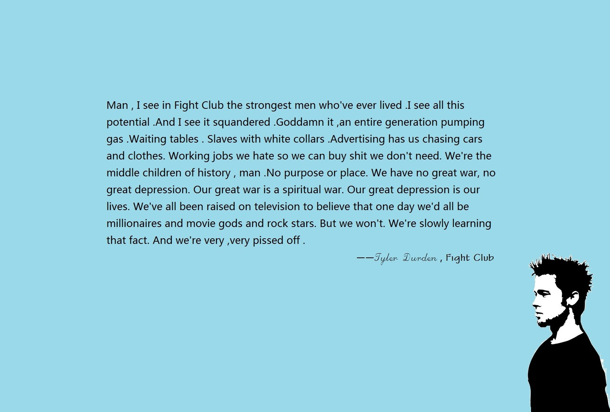

<!-- 标题 + 个人描述, emoji 取自: http://emojihomepage.com -->

  <h1 height="200px" align="center">
    Hi , I'm Gafford
  </h1>
   
A programmer who doesn't feel like coding.👨‍💻

   
💢Fuck off!

<!-- 
  技术栈标签, 小标签来自: https://shields.io/
  1. shields 链接格式: https://img.shields.io/badge/-{标签文本}-{标签背景色}?style={标签类型}&logo={标签前面 Logo}&logoColor={Logo 颜色}
  2. shields 可选 Logo 列表参考: https://github.com/simple-icons/simple-icons/blob/develop/slugs.md
-->

  
  
  
  
  

